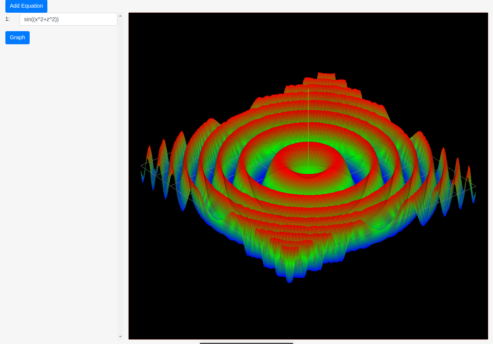

this is me learning and experimenting with three.js.

while I was studying and enjoying Calculus, I built an application that could plot a 3D graph from an equation ( the equation must be in the form f(x,z), and a graph will be plotted for y=f(x,z) ( see example screenshot )  
this project is really old and has some problems because it was abandoned when I found out that if you just [googled z=x^2+y^2](https://www.google.com/search?q=z%3Dx%5E2%2By%5E2), it shows you a nice little graph :') )

Here are some cool equations for trying it out:
- cos(abs(x)+abs(z))\*(abs(x)+abs(z))
- x^2-z^2
- cos(abs(x)+abs(z))
- abs(x)-abs(z)
- (x^2+z^2)^0.5
- cos(x^2+z^2-0.5)-0.5

### Screenshots:

